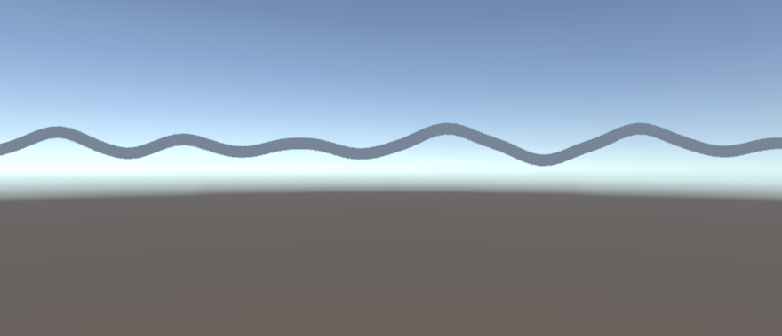
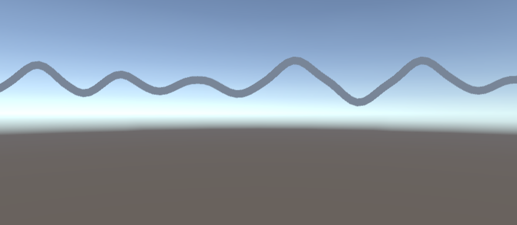
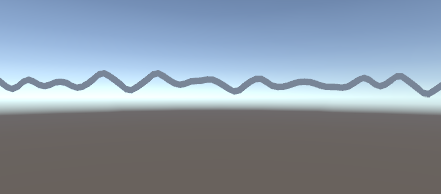
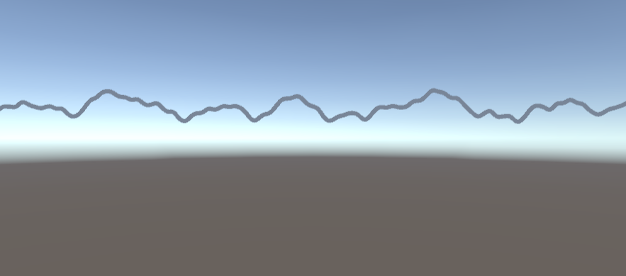

# Procedural Map Creator in Unity using Perlin Noise

This project is focus on the creation of maps dynamically with the use of the Perlin Noise algorithm, it will explore and study its complexity step by step with the use of C++ and Unity (version 2021.3.10f1).

## Perlin Noise

When using random algorithms, machines tend to take numbers far from each other, if it uses them for example to build a graph it will result on a illegible and chaotic figure. When talking about "Noise" is important to take in count that it is also a random algorithm but with a step. 

When talking more specifically about Perlin Noise, we are talking about an algorithm that when it takes a number at any time "t", it is related to its brother "number t + 1" and "number t - 1", resulting on a smoother graph, in a way, Perlin Noise can be considered a "Smooth Random Generator Algorithm".

To put more context on this topic, Ken Perlin, the original creator of this algorithm, created on the 1980's to help on the creation of textures of 3D objects on Tron, the idea was to create a "Procedural Texture Creator" that would take seconds to create something that artists would need days.

This can be helpful on different enviroments such as map creators, which can use the calculated values to establish mountain, valleys, etc. more naturally with less steep slopes. Now a days games like Mincraft use similar algorithms to create not only the terrain but the different biomes.

## Development

Lets go step by step developing the algorithm on different dimensions.

### 1 Dimension

When using the algorithm on 1D the numbers chosen range between 1 and -1, it is important to make a smooth interpolation (not linear) between this numbers, here Unity helps a lot with the development since it already incorporate its own interpolation.

Some important terms used when creating a Perlin Noise algorithm are: _Octaves_, _Frecuency_ and _Amplitude_. The last two are used regularly when talking about: functions, waves, etc. the first term _Octave_ refers to an existing Noise layer on the whole Perlin Noise value.

About the _Frecency_ and _Amplitude_ they can give different and interesting results depending on the values used, the _Frecuency_ is how much samples are taking within time, while the _Amplitude_ is refer to the maximun value that can be taken of the sample.

  
  
  

while this representations can be fascinating by themselves, they ca be fused to give even more complex Perlin Noise graphs, when doing this, it can be said that each one of those graphs are _Octaves_.

  

