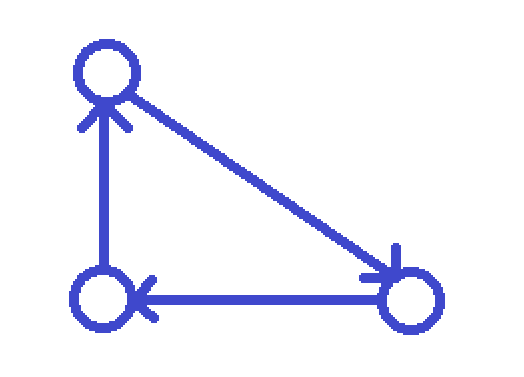
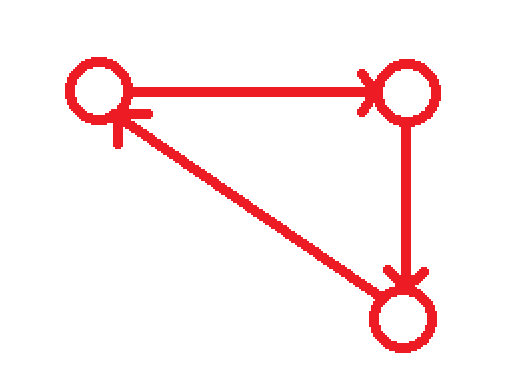

# Procedural Map Creator in Unity using Perlin Noise

This project is focus on the creation of maps dynamically with the use of the Perlin Noise algorithm, it will explore and study its complexity step by step with the use of C++ and Unity (version 2021.3.10f1).

## Perlin Noise

When using random algorithms, machines tend to take numbers far from each other, if it uses them for example to build a graph it will result on a illegible and chaotic figure. When talking about "Noise" is important to take in count that it is also a random algorithm but with a step.

When talking more specifically about Perlin Noise, we are talking about an algorithm that when it takes a number at any time "t", it is related to its brother "number t + 1" and "number t - 1", resulting on a smoother graph, in a way, Perlin Noise can be considered a "Smooth Random Generator Algorithm".

<p align="center">
  
  
</p>


To put more context on this topic, Ken Perlin, the original creator of this algorithm, created on the 1980's to help on the creation of textures of 3D objects on Tron, the idea was to create a "Procedural Texture Creator" that would take seconds to create something that artists would need days.

This can be helpful on different enviroments such as map creators, which can use the calculated values to establish mountain, valleys, etc. more naturally with less steep slopes. Now a days games like Mincraft use similar algorithms to create not only the terrain but the different biomes.

## Development

Lets go step by step developing the algorithm on different dimensions.

### 1 Dimension

When using the algorithm on 1D the numbers chosen range between 1 and -1, it is important to make a smooth interpolation (not linear) between this numbers, here Unity helps a lot with the development since it already incorporate its own interpolation.

Some important terms used when creating a Perlin Noise algorithm are: _Octaves_, _Frecuency_ and _Amplitude_. The last two are used regularly when talking about: functions, waves, etc. the first term _Octave_ refers to an existing Noise layer on the whole Perlin Noise value.

About the _Frecency_ and _Amplitude_ they can give different and interesting results depending on the values used, the _Frecuency_ is how much samples are taking within time, while the _Amplitude_ is refer to the maximun value that can be taken of the sample.

<p align="center">
  
  
  
</p>

while this representations can be fascinating by themselves, they ca be fused to give even more complex Perlin Noise graphs, when doing this, it can be said that each one of those graphs are _Octaves_.

<p align="center">
  
</p>

This _Octaves_ can be used, not only over other Perlin Noise but in other functions, in this example, Perlin Noise is being applide to a Sine one.

A curiosity about these Perlin Noise Graphs is the fact that they can be considered fractals, since the same pattern can be found over and over again regardless of how big, small or how many reference points are taken in the samples.

### 2 Dimensions

Before talking about Perlin Noise on 2 Dimensions there are some issues that need to be work on, such as the terrain.

Although Unity is a great engine to work around geometry, there are some limitations that can be fixed manually, one is the default plane, the main problem with this plane is the fact that it cannot be modify beyond some veriables such as the scale, position and rotation.

When handling this type of problems on geometry, variable such as vertices, are one of the most important thing to take in count, so in this type of problems creating your own plane is the optimal option.

## Creating a plane

As said before, when creating a plane, one of the most important things are the vertices, to understand better how a plane works in unity is important to know its design.

A plane is nothing more than a group of vertices joined by lines to form triangles, therefore in order to create one, it is necessary to establish how many vertices are wanted and its respective (plane local) positions. Once thay all are fixed the next step is to find a way to join each one of them with its respective neighbors in a certain order so that the plane can be render and behave correctly.

<p align="center">
  
  
</p>

when creating a triangles from a vertice it is important to choose a clockwise order as explained before, with this order the triangle will render and behave correctly.

<p align="center">
  
</p>

This example shows a very simple plane created by 2 triangles, if both (clockwise and counter clockwise) are made when creating the triangles a double-side render plane will be created, a better yet more expensive solution.

Other thing to take in count is the _definition_ of the plane, this _definition_ is used to measure how many vertices are gonna be needed to create the pleane, the more vertices the "better" the plane will look, knowing that it will also need to compute more values.

<p align="center">
  
  
</p>

## Lee and Schachter and the Delaunay Triangulation

Even tho this plane is already functional and with some variations on the _frecuency_, _amplitude_, _definiton_ and _size_ there could be a map, this approach seems pretty simple since the map is basically a X times Y matrix, to fix this there some algorithms that can result on a more complex terrain, the Voronoi Diagram for example can be helpful to get irregular zones determined by the initial position of some sample points, this diagram is used frequently to separate certain points with the distance between each other and created with the bisectors of the segment between two points, it can create poligonal like images, which worked on can result on a more realistic and "random" terrain.

Before working with voronoi it is important to have a good plane to work with given some random points, Delaunay Triangulation is a good approach since it creates a plane with the minimun edges and triangles needed.

The fundamental idea which this triangulation apply is that each existing circumcircle can only surround its respective triangle, without including any other vertex.

# Creating a convex hull

Using a Divide and Conquer algorithm, given N points this algorithm recursively half the amount of points until it isolates either 3 or 2 points. After that, the vertices are joined in a counterclock wise order (if there are only 2 points they are joined left to right).

<p align="center">
  
</p>

Once the points are joined, the "Conquer" phase starts, on this part the hull created merges with the one immediately to the left searching both the lower and upper tangent, resulting on a Convex Hull.

<p align="center">
  
</p>

Pseudocode to fnid the lower tangent:

```
X <-- RM(VL); Y <--LM(VR)
Z2 <-- RIGHT(X, SON(X)) Z <<-- LEFT(Y, FATHER(Y))

WHILE(Z is-right-of l(X, Y) || Z2 is-right-of l(X, Y))
	IF(Z is-right-of l(X, Y))
		OldY <-- Y
		Y <-- Z
		Z <-- LEFT(Y, OldY)
   	ELSE
		IF(Z2 is-right-of l(X, Y))
			OldX <-- X
			X <-- Z2
			Z2 <-- RIGHT(X, OldX)
END HULL
```

A loop that goes through both (Left and Right) hull's vertices will compare each one of them until a certain condition is met, on the lower tangent that condition will be that there are no other vertices on the right side of the tangent while on the upper tangent is the opposite no other vertices must be on the left side.

To achive this, the algorithm starts with the same approach explained on the Lee and Schachter paper, it takes both the rightmost (RM, on the left hull) and the leftmost (LM, on the right hull).

To check if the condition is met angles are the most important asset, starting with the RM and LM, and travesing either counter clockwise or clockwise through each hull, samples points are taken, the sample point must be the one which has the smallest angle from the previous point.

<p align="center">
  
</p>

Once the points are taken the main loop after, checks whether they are the correct ones (checking if no other vertices are on the right or left side of the tangent created) or wheter new points are needed, if so the main loop repeats the same operation and checks the angles to select the new chosen vertex.

When the condition is met on both hulls with a certain tangent that tangent is selected as the lower/upper one, and a new convex hull is created.

<p align="center">
  
</p>

# Delaunay Merge

Once both hulls are merged, the next step is to join each vertex so that the Delaunay condition is met, to do this, the algorithm iterates on the new Hull created through the points.

To calculate if a point meets the Delaunay condition a _QTest_ is made, this test requires 4 sample points, 3 of them (P1, P2, P3) are used to create a circle, the other one _Q_ is checked to see if its inside or outside that circle, the condition is met once a point is found outside the circle, until then the algorithm keeps ierating through the points following the _Right_ or _Left_ function depending on the side is being worked on.
